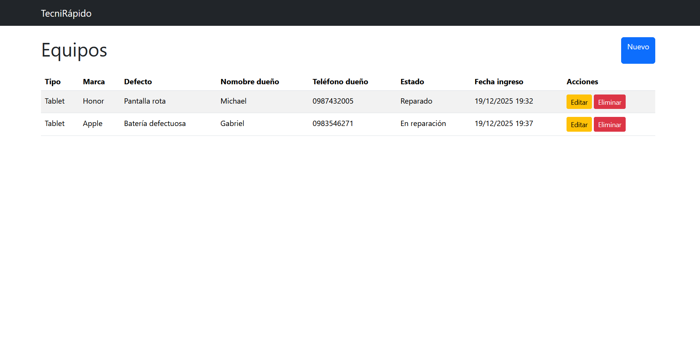
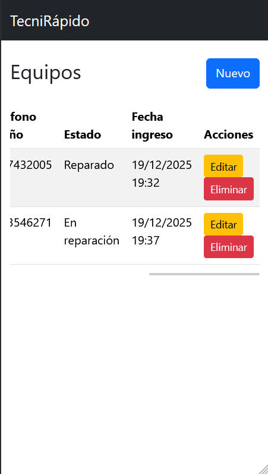

<h1> Exámen en Laravel</h1>

<h2>Link de GitHub</h2>
https://github.com/GlieseKep/prueba-laravel

<h1>Decisiones de Diseño</h1>

<h2>1. Tabla</h2>

<strong>Nombre de la tabla: </strong> <code>equipo</code>

<h3>Campos</h3>

<table>
  <thead>
    <tr>
      <th>Campo</th>
      <th>Tipo</th>
      <th>¿Obligatorio?</th>
    </tr>
  </thead>
  <tbody>
    <tr>
      <td><code>id</code></td>
      <td>bigIncrements</td>
      <td>Sí</td>
    </tr>
    <tr>
      <td><code>tipo</code></td>
      <td>string</td>
      <td>Sí</td>
    </tr>
      <tr>
      <td><code>marca</code></td>
      <td>string</td>
      <td>Sí</td>
    </tr>
    <tr>
      <td><code>defecto</code></td>
      <td>string</td>
      <td>Sí</td>
    </tr>
    <tr>
      <td><code>nombre_duenio</code></td>
      <td>string</td>
      <td>Sí</td>
    </tr>
    <tr>
      <td><code>telefono_duenio</code></td>
      <td>string</td>
      <td>No</td>
    </tr>
    <tr>
      <td><code>estado</code></td>
      <td>int</td>
      <td>Sí</td>
    </tr>
  </tbody>
</table>

<h2>2. Tipos de dispositivo</h2>

El sistema maneja los siguientes tipos de dispositivos:

<ul>
  <li>Teléfono</li>
  <li>Tablet</li>
</ul>

<h2>3. Tipos de estados</h2>

El sistema maneja los siguientes tipos de estados:

<ul>
  <li>Revisado</li>
  <li>En reparación</li>
  <li>Reparado</li>
  <li>No necesito arreglo</li>
</ul>

Revisado
En reparación
Reparado
No necesitó arreglo

<h2>4. Eliminación de Registros</h2>

La opción de eliminar de eliminar un registro no existe para así tener un historial de los dispositivos que se han trabajado y que defectos tenían.

<h2>5. Capruras de pantalla</h2>

<h3> Listado</h3>

<h3> Listado en teléfono</h3>

<h3> Formulario</h3>

<h3> Formulario en teléfono</h3>

